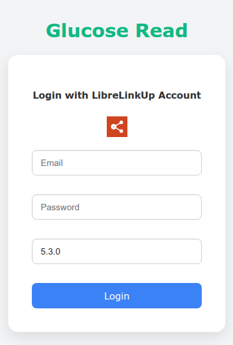
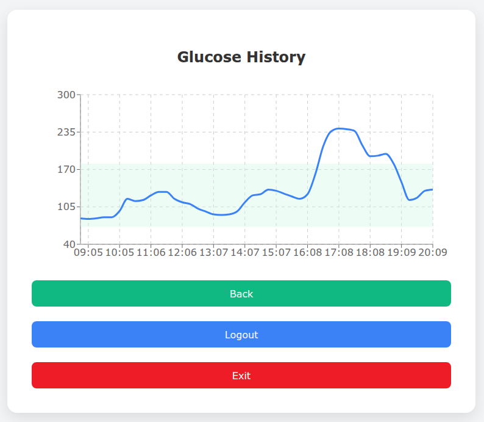
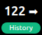

# desktop-gr
Desktop Glucose Read

It's a desktop Aplication that uses the following repo:
```
https://github.com/DiaKEM/libre-link-up-api-client
```
- It takes the data from LibreLinkUp, so you need an account and login with the same credentials. It works in Ubuntu, Windows and iOS.  
- It is set to be always on top, so you can drag it wherever, and it's small, only 62x50 pixels.  
- The version is parameterized because when the LibreLinkUp endpoint changed its header, it was no longer possible to retrieve glucose levels. This way, version 5.3.0 is currently the latest one and works correctly, but it may change in the future.

# Screenshots


<br>
<br>

<br>
<br>


<br>

RUN:
```
npm install
npm run start
```
If permission error:
```
sudo chown root:root node_modules/electron/dist/chrome-sandbox
sudo chmod 4755 node_modules/electron/dist/chrome-sandbox
```

[Download Windows](https://github.com/lrrinaudo/desktop-gr/releases/download/untagged-03f6318777d52095b750/Desktop-GR-Setup-1.0.0.exe)  
[Download Linux](https://github.com/lrrinaudo/desktop-gr/releases/download/untagged-03f6318777d52095b750/desktop-gr_1.0.0_amd64.deb)  
[Download iOS](https://github.com/lrrinaudo/desktop-gr/releases/download/untagged-03f6318777d52095b750/Desktop-GR-1.0.0.AppImage)  

Or just go to Releases and then Assets.